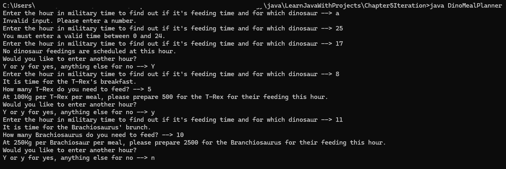

# Dino-Meal-Planner
A program in Java demonstrating conditional statements, iteration, and a little bit of exception handling by asking the user for the hour, how many of each species of dinosaur, and calculating the total food that will be needed during that meal to feed them, accordingly.

# Total-Weight-Of-Dinosaurs
A program in Java demonstrating conditional statements, iteration, and a little bit of exception handling by asking the user to enter the weight of dinosaurs in an enclosure or -1 to quit.

## Table of contents
* [General Info](#General-info)
* [Author](#Author)
* [Programming Approaches](#Programming-approaches)
* [Techologies](#Technologies)
* [Setup](#Setup)
* [Usage](#Usage)
* [Minimum hardware requirements](#Minimum-hardware-requirements)
* [Screenshots](#Screenshots)
* [Project status](#Project-status)
* [Room for improvement](#Room-for-improvement)
* [Notes](#Notes)
* [Release date](#Release-date)
* [Sources](#Sources)
* [Contact](#Contact)

## General info
DinoMealPlanner.java is a program I wrote in Java as a solution to the Chapter 5 Project - Dino meal planner in the book Learn Java with Projects by Dr. Sean Kennedy and Maaike van Putten.

## Author
- Jason Ash, Computer Science Major

## Programming approaches
-  As suggested, I declared and used an integer for each hour.
-  I also used the default feeding times: Hours 8, 14, and 20 for T. rex, and 7, 11, 15, and 19 for Brachiosaurus.
-  The default of 100kg of food per T. Rex per meal and 250kg of food per Brachiosaurus per meal was also used.
-  I compared the time entered with the feeding time for each species to determine if something would be output for that hour.
-  Additionally, I let the user enter the quantity of each dinosaur for the species that gets fed at that hour to calculate the total food that a feeder would need to prepare and bring to the enclosures.
-  I allowed 0 to 24 to be entered for the current hour, even though 0 overlaps with 24 (just in case someone enters 24 instead of 0, the input would still be considered valid).
-  The user can keep entering a different time and a different number of the respective species that is fed at that hour to view the results.
-  The quantity to feed each member of a species was declared using the final access modifier, even though the book has barely covered this modifier so far.
-  Try-catch blocks handled the exception that occurs when the user enters something other than a number when prompted, giving them another chance instead of the program crashing.
-  An if-else structure was used to determine the string name for the meal based on the hour entered by the user.
-  Then, a switch statement was used to determine whether it was feeding time and for which dinosaur species.
-  Within the cases corresponding to the times for feeding, it asks the user how many of each and displays the amount of food as calculated by (number of members of that species * how much they eat per meal).
-  Finally, the user is asked if they want to enter another time, and the program keeps looping if 'y' or 'Y' is entered.

## Technologies:
I wrote the source code in Notepad in Windows 11, compiled it in the Command Prompt using the javac command, and ran it using the java command.

## Setup
To compile this .java file into Java bytecode, you can use the command line like I did or your favorite IDE of choice.

## Usage
- After running the program, enter an integer between 0 and 24 corresponding to the hour of the day that you want to check to see if it's a feeding time, for which dinosaur type, and which meal of the day.
- If the hour corresponds to a feeding time, enter the number of that particular species in the enclosures.
- The program will output the total amount of food needed to feed all of them during that meal.
- Enter y or Y if you want to enter another time, or any other input to quit.

## Minimum hardware requirements
Although I developed this on a fairly recent Windows 11 PC, this program should run comfortably on any working computer with sufficient processing power, RAM, a monitor manufactured within the past 15-20 years, and an Internet connection to download the .java source file. 

## Screenshots

## Project status
Since it satisfies and exceeds the requirements of the Chapter 5 Project in this book, I'm releasing my solution on GitHub.

## Room for improvement
- I could learn how to use the time and date libraries in Java so that the user can enter an exact time, and then compare that to how close it is to a feeding hour (perhaps with rounding up and down being used).

## Notes
- Although no Internet searches or AI were used in writing this program, I searched Google afterwards to see if "T. rex" and "Brachiosaurus" can be used for both singular and plural, and that is indeed the case (and more scientifically correct).
- T-Rexes can also be used for the plural, but since that is awkward, I decided not to go in that direction.
- Brachiosaurs, Brachiosauruses, or Brachiosauri can also be used for plural, but they are not as scientifically correct as using Brachiosaurus for both the singular and plural.

## Release date
26 April, 2026

## Sources
This program is my solution to the Chapter 5 Project prompt in the Learn Java with Projects book.

## Contact
Jason Ash - wizardofki@gmail.com
